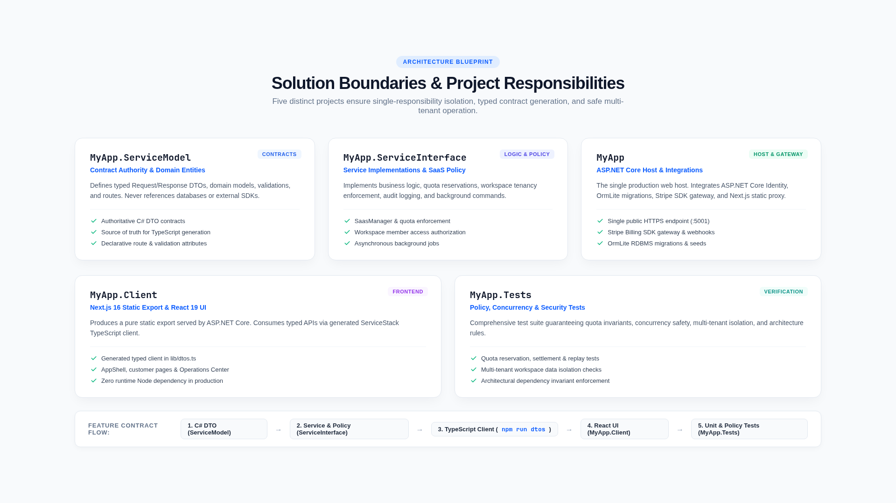

# Development recipes

These recipes are the shortest safe paths for extending Next SaaS while preserving typed contracts, organization isolation, entitlements, quota correctness, and static-export compatibility.

[Documentation home](../README.md)

## Choose a recipe

| Goal | Guide |
| --- | --- |
| Add a typed backend endpoint | [Add a ServiceStack API](add-a-servicestack-api.md) |
| Sell or restrict a capability | [Add a feature gate](add-a-feature-gate.md) |
| Measure and limit customer activity | [Add a meter and quota](add-a-meter-and-quota.md) |
| Run reliable work outside a request | [Add a background job](add-a-background-job.md) |
| Change persistent product data | [Database migrations](database-migrations.md) |
| Build an authenticated product screen | [Add a frontend page](add-a-frontend-page.md) |
| Refresh the TypeScript client | [Generate typed DTOs](generate-typed-dtos.md) |
| Prove behavior and prevent regressions | [Testing](testing.md) |
| Work effectively with coding agents | [AI-assisted development](ai-assisted-development.md) |

## Typical full-stack change

For a new quota-controlled product capability, use this order:

1. define the request/response contract;
2. register its feature and meter keys;
3. add persistence and a migration if necessary;
4. implement tenant-bound authorization and metering;
5. regenerate TypeScript DTOs;
6. add the static-compatible frontend page;
7. test policy boundaries and UI behavior;
8. run `./scripts/verify.sh`.

Keep global product policy in JSON, plan and customer state in the RDBMS, and provider secrets in environment configuration.

