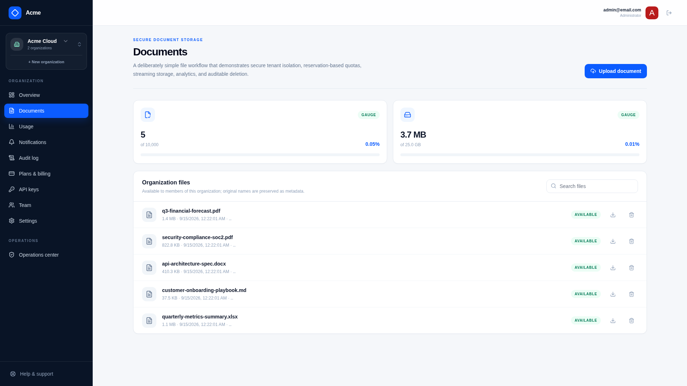
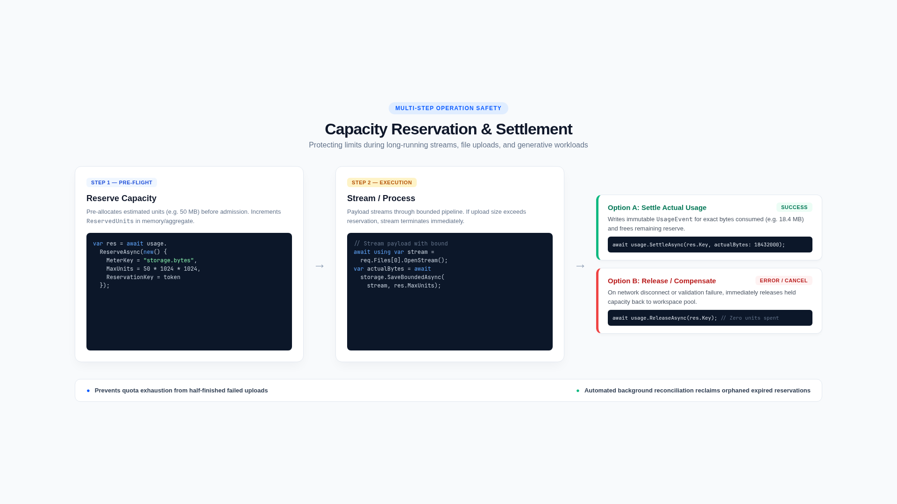

# File storage

The Acme sample stores ordinary files to demonstrate feature gates, document-count quotas, byte quotas, idempotency, analytics, and cleanup without imposing a document-processing domain.

[Documentation home](../README.md) · [Usage and quotas](../concepts/usage-and-quotas.md)

## APIs

| Operation | Route |
| --- | --- |
| List/search | `GET /saas/files` |
| Upload | `POST /saas/files` |
| Download | `GET /saas/files/{Id}` |
| Delete | `DELETE /saas/files/{Id}` |

Upload, download, and delete require the `files.basic` entitlement. Every lookup is constrained to the active organization. Upload is multipart and requires an `IdempotencyKey`.



## Storage model

`StoredFile` keeps tenant-safe metadata in the RDBMS. `IFileStore` stores bytes behind an opaque object key and exposes write, read, delete, and existence operations. `LocalFileStore` is the default implementation and writes beneath `FileStorage.RootPath`.

Do not expose physical paths to customers or use user-provided filenames as object keys. To adopt S3, Azure Blob Storage, or another provider, replace `IFileStore` while retaining metadata, organization isolation, and cleanup semantics.

## Quota transaction

An upload follows a reserve/perform/settle pattern:

1. validate membership, entitlement, extension, and configured maximum size;
2. reserve one `documents` unit and the expected `storage.bytes` capacity;
3. stream to `IFileStore`, enforcing the byte maximum and calculating SHA-256;
4. settle the reservations to actual usage and commit metadata;
5. compensate reservations and remove partial bytes if any step fails.

Delete makes the file unavailable and queues physical cleanup. This keeps the customer request fast and makes retries safe.



## Configuration

```json
{
  "FileStorage": {
    "RootPath": "App_Data/files",
    "MaxFileBytes": 104857600,
    "AllowedExtensions": [ ".pdf", ".txt", ".md" ]
  }
}
```

`MaxFileBytes` is a global safety limit. Plan quotas remain customer-specific commercial limits. Validate file content independently if the derived product accepts untrusted formats; an extension and browser content type are not security boundaries.

## Extension points

- Replace `IFileStore` with cloud object storage and use short-lived signed downloads where appropriate.
- Add malware scanning as a background transition before marking a file available.
- Add domain metadata in separate tenant-bound tables rather than overloading `StoredFile`.
- Emit new meter events only through the quota manager so failure compensation remains correct.

## Verify

Test allowed and blocked extensions, empty and oversized files, duplicate idempotency keys, hard quota rejection, interrupted writes, cross-tenant IDs, downloads, deletes, retry cleanup, and empty-state recreation.

## Related documentation

- [Plans, pricing, and trials](plans-pricing-trials.md)
- [Usage analytics](usage-analytics.md)
- [Data lifecycle](data-lifecycle.md)

