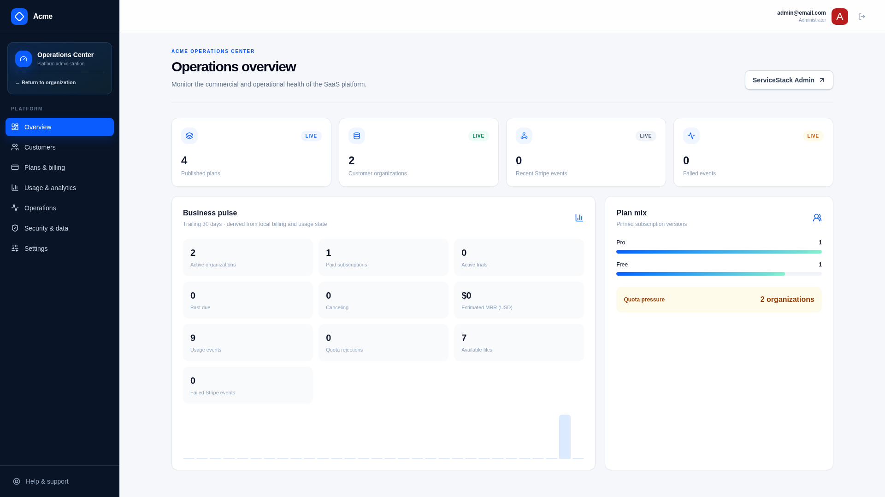
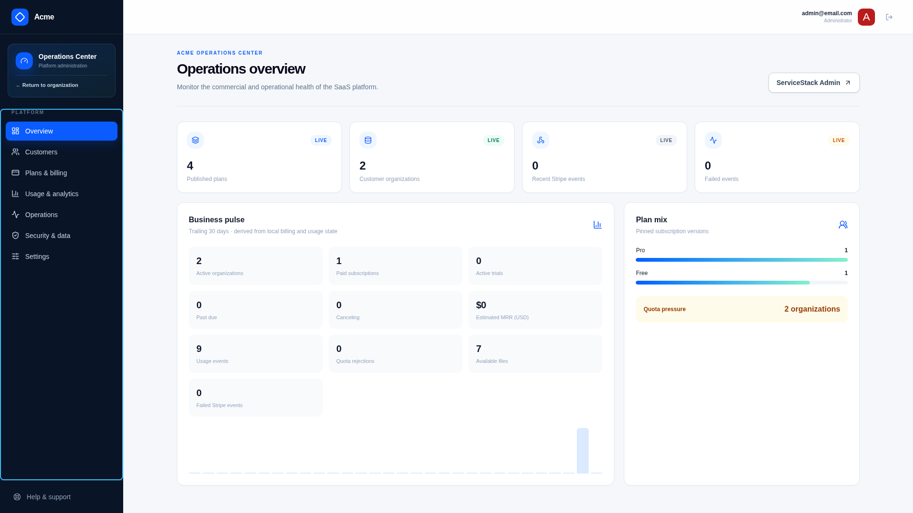

# Operations

These guides cover the path from validated configuration to a recoverable, observable production deployment.

[Documentation home](../README.md)

## Runbooks

| Need | Guide |
| --- | --- |
| Understand settings and ownership | [Configuration](configuration.md) |
| Store and rotate sensitive values | [Secrets](secrets.md) |
| Build, migrate, and release | [Deployment](deployment.md) |
| Operate PostgreSQL and file storage | [Database and storage](database-and-storage.md) |
| Configure probes, logs, metrics, and alerts | [Observability and health](observability-and-health.md) |
| Inspect and recover asynchronous work | [Background jobs and recovery](background-jobs-and-recovery.md) |
| Operate Stripe and SMTP dependencies | [External services](external-services.md) |
| Enforce cleanup and legal holds | [Retention and lifecycle](retention-and-lifecycle.md) |
| Prepare for and execute recovery | [Backup and restore](backup-and-restore.md) |
| Diagnose common failures | [Troubleshooting](troubleshooting.md) |

## Production release checklist

1. provision PostgreSQL, durable file/object storage, SMTP, Stripe, DNS, and TLS;
2. store production secrets outside the repository;
3. export the production configuration and run `./scripts/preflight.sh`;
4. back up current durable state and verify restore readiness;
5. run compatible database migrations as a deliberate release step;
6. deploy the immutable application image;
7. wait for `/ready` before admitting traffic;
8. verify Stripe webhooks, email delivery, jobs, and customer/API-key flows;
9. monitor errors, queue failures, quota rejection, and billing reconciliation.

The included Kamal/GitHub workflow is a starting point. Adapt migration ordering, storage, backup, secret management, and observability to the target platform before accepting production data.

